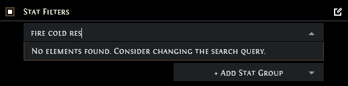
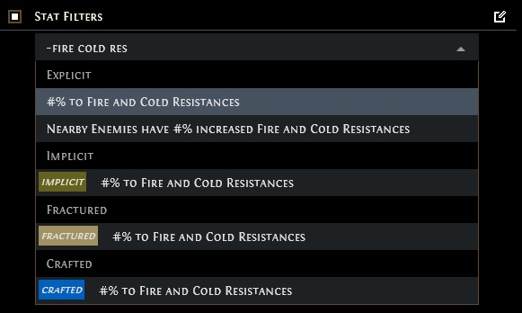
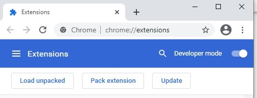
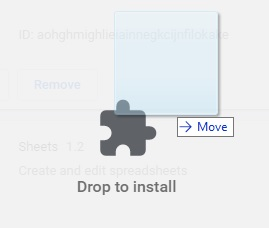

# POETradeFuzzySearch
When searching on pathofexile.com/trade, this addon inserts the tilde(~) before your search query. This enables fuzzy search, so you can be more lenient with your search.

For example, when searching for "#% to Fire and Cold Resistance" it's enought to just write "fire cold res". Without fuzzy search, this would not find the modifier.

---

Without fuzzy search:

With fuzzy search:

---

## Install: ##

This Extension is available for **Firefox**, **Chrome** or as a **Greasemonkey** userscript

### **Firefox**: ###
Just install it from the Firefox Webstore [here](https://addons.mozilla.org/en-US/firefox/addon/poetrade-fuzzy-search/)

NOTE: At the time of writing, the extension site for Firefox still needs to verify the extension before its up . So at the moment, it might only show an error. I hope its verified soon.

### **Chrome**: ###
You need to install it manually. Don't worry, it's not hard:

1. Download the extension from the releases tab to the right.
2. Go to "chrome://extensions".
3. On the top right corner, enable developer mode. You should see the "Load unpacked", "Pack extension" and "Update" buttons now.

4. Drag and drop the downloaded .crx file into the window

5. Click on "Add extension"

6. Finished. See you in game :)

You might end up with this Warning:
~~~
"This Extension is not listed in the Chrome Web Store and may have been added without your knowledge."
~~~
This is not a problem, the extension should work fine regardless.

### **Greasemonkey or Alternatives** ###
The `POETradeFuzzySearch.gm_script` file contains a userscript for the Greasemonkey Extension (or any of its alternatives). This should work with any browser that has a Greasemonkey extension.